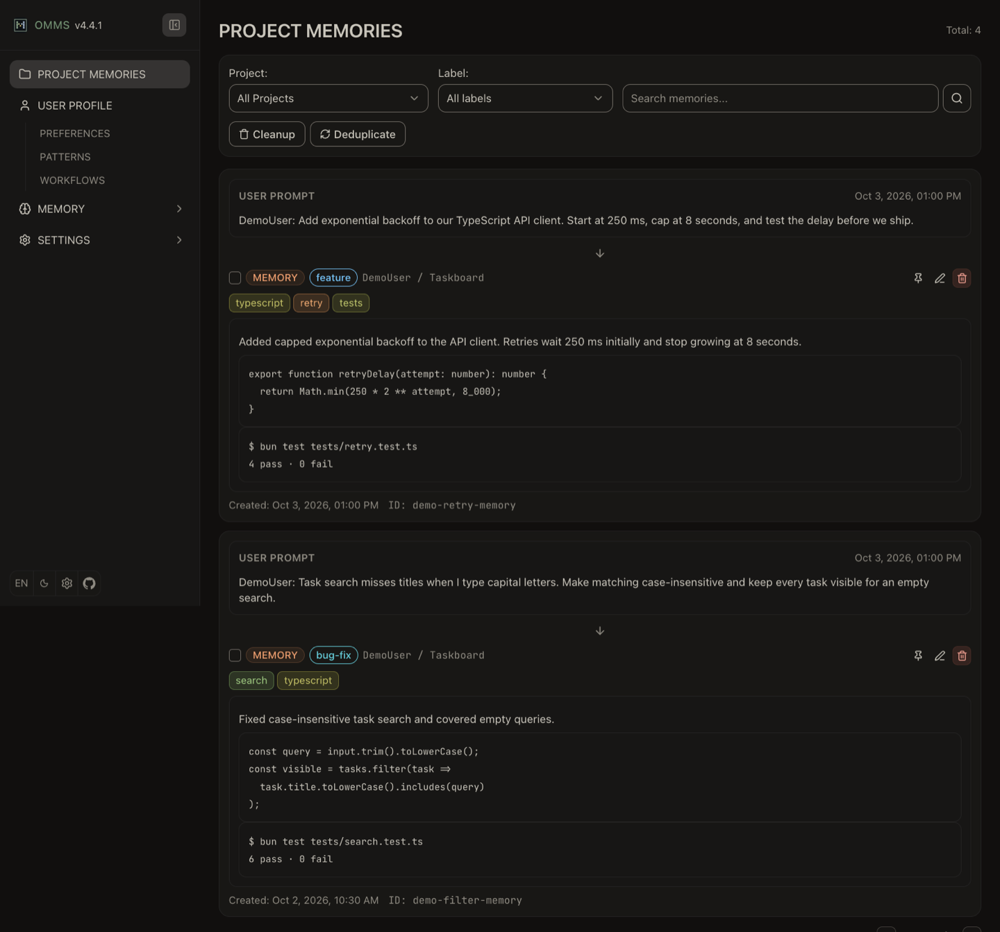
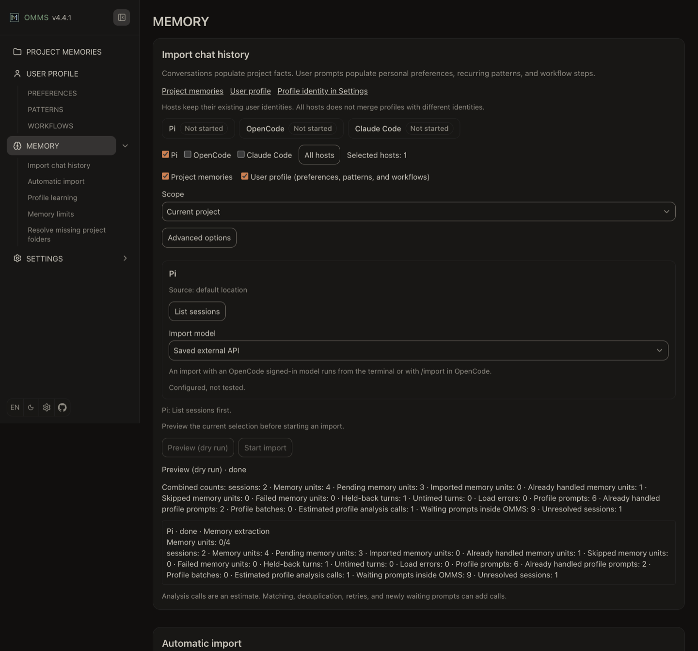
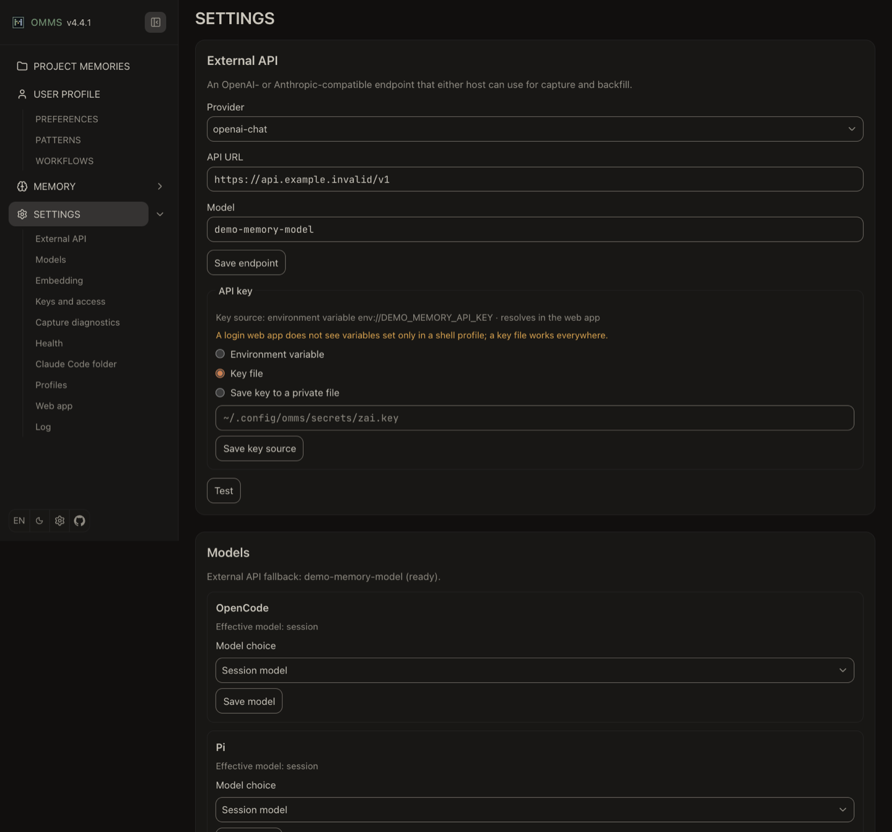

<p align="center">
  
</p>

# OMMS: Opinionated Modular Memory System

[](https://www.npmjs.com/package/om-memory-system)
[](https://www.npmjs.com/package/om-memory-system)
[](LICENSE.md)

OMMS gives AI coding agents long-term project memory. It captures technical
work, recalls relevant notes in later sessions and learns your working
preferences. One shared engine serves **OpenCode**, **Pi** and **Claude Code**,
so each host can retrieve memories captured by the others in the same project.

Memories are stored locally, by default in `~/.omms/data`. Embeddings run
locally by default; the first use downloads a search model. Capture and profile
learning make additional model calls that can send conversation content to your
chosen provider and incur costs. Remote embeddings are optional. OMMS removes
text inside `<private>` tags before storage. See [Configuration](docs/configuration.md)
for model choices and privacy controls.

## Set up

Use Node.js **22.14 or later** for the terminal command and Claude Code hooks.
OpenCode v1 needs **1.18.29 or later**. OMMS also supports OpenCode v2 and the
[Pi coding agent](https://www.npmjs.com/package/@earendil-works/pi-coding-agent).

> Automatic history import is enabled by default and makes model calls.
> To disable it before your first session, set `"autoBackfill": false` in
> `~/.config/omms/omms.jsonc`. See [Automatic import](docs/web-ui-memory.md#automatic-import).

### OpenCode

Add the package to `~/.config/opencode/opencode.json`. Keep your existing settings.
On Windows, use `%USERPROFILE%\.config\opencode\opencode.json`.

**OpenCode v2:**

```json
{ "plugins": ["om-memory-system"] }
```

**OpenCode v1:**

```json
{ "plugin": ["om-memory-system"] }
```

OpenCode v2 also supports:

```bash
opencode plugin add om-memory-system
```

Restart OpenCode. The [OpenCode guide](docs/opencode-adapter.md#installation)
covers plugin management and its additional `cli.json` configuration.

### Pi

```bash
pi install npm:om-memory-system
```

Restart Pi. See the [Pi guide](docs/pi-adapter.md).

### Claude Code

Install the OMMS plugin using the [Claude Code guide](docs/claude-code-adapter.md#installation).
Capture and profile learning require a configured external API; retrieval and
manual memory operations remain available without it. A global npm install is optional.

### Model and web app

With no model settings, OpenCode and Pi use the session model. You can choose a
host model or configure an external API under **Settings**. Claude Code uses
only the external API. See [Choosing the model](docs/configuration.md#choosing-the-model)
for the selection order and credentials.

Start a host session, then open [http://127.0.0.1:4747](http://127.0.0.1:4747).
Each host starts the shared web app when needed, unless it is disabled. Browse
captured notes on **Project memories**, or ask your agent to search memory for
an earlier decision.

### Terminal command (optional)

A global install puts `om-memory-system` on your `PATH`:

```bash
npm install -g om-memory-system
om-memory-system --version
```

See the [CLI reference](docs/cli.md) for manual memory operations and history imports.

## Inside OMMS

These screenshots use synthetic examples and configuration. All visible prompts,
code snippets and outcomes are made up for the demonstration.

### Project memories

Browse captured notes alongside example user input and technical outcomes.



### Memory

Review history imports, manage profile learning and set memory limits. This page
also helps resolve missing project folders.



### Settings

Choose models and manage access. Diagnostics show capture outcomes and component health.



## Documentation

| Guide                                       | Covers                                                       |
| ------------------------------------------- | ------------------------------------------------------------ |
| [Using memory](docs/using-memory.md)        | Daily use, capture, recall and the user profile              |
| [Web UI](docs/web-ui.md)                    | Starting the app, browsing memories and safe network access  |
| [Memory page](docs/web-ui-memory.md)        | History imports, profile actions, limits and missing folders |
| [Settings page](docs/web-ui-settings.md)    | Models, credentials, diagnostics and profile identities      |
| [Configuration](docs/configuration.md)      | Config files, model selection, privacy and embeddings        |
| [Moving projects](docs/moving-projects.md)  | Folder moves, backup and restore                             |
| [Updating and upgrading](docs/upgrading.md) | Updates, version pinning and older stores                    |
| [CLI reference](docs/cli.md)                | Terminal commands                                            |
| [For developers](docs/developers.md)        | Building, testing and architecture                           |
| [Contributing](CONTRIBUTING.md)             | Development workflow and pull requests                       |

History import guides: [OpenCode](docs/opencode-history-import.md),
[Pi](docs/pi-history-import.md) and [Claude Code](docs/claude-code-history-import.md).
See [UPDATES.md](UPDATES.md) for host update commands and
[CHANGELOG.md](CHANGELOG.md) for release changes. Existing `opencode-mem` users
can follow the [migration guide](docs/omms-migration.md).

## Licence

MIT. See [LICENSE.md](LICENSE.md) for copyright and attribution, and
[THIRD_PARTY_NOTICES.md](THIRD_PARTY_NOTICES.md) for bundled dependencies.

[Repository](https://github.com/cmdaltctr/omms) ·
[Issues](https://github.com/cmdaltctr/omms/issues) ·
[Documentation index](docs/README.md)
